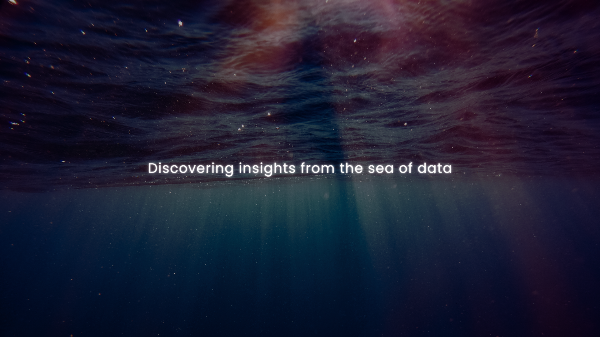

     
    <h1 align="center">
    <b>Welcome to my GitHub! I’m Hai Vu 👋😄</b>
    </h1>

&nbsp;
&nbsp;

<h3>I’m a data analytics & data science enthusiast 🔎👀</h3>

- 🌱 I graduated from Northeastern University with a master's in Analytics 
- 📔 I'm currently learning Data Analytics by myself through doing independent projects in SQL, Python & R
- 💞️ I'm looking to connect with people who share the same interests
- ⚡ Fun fact: I enjoy watching the Premier League ⚽ and playing basketball 🏀 in my free time
- 📫 You can reach me at namhaivu97@gmail.com or via <a href="https://www.linkedin.com/in/hai-vu/">my Linkedin</a>

<h3>Data tools and languages 💻</h3>

 
 
 
 

    

        <h3><ins>Click here to view my resume</ins> 📝</h3>
    

    

<!--
**namhaivu173/namhaivu173** is a ✨ _special_ ✨ repository because its `README.md` (this file) appears on your GitHub profile.

[Click to access my resume](https://github.com/namhaivu173/namhaivu173/blob/9b26f9225f015540fb6fa67c7d7dc49e16c3ed0d/HAI%20NAM%20VU%20Resume.pdf)
<a href="https://bit.ly/3Tx80ZH" target="_blank"><i>Click here to access PDF version</i></a>

Here are some ideas to get you started:

- 🔭 I’m currently working on ...
- 🌱 I’m currently learning ...
- 👯 I’m looking to collaborate on ...
- 🤔 I’m looking for help with ...
- 💬 Ask me about ...
- 📫 How to reach me: ...
- 😄 Pronouns: ...
- ⚡ Fun fact: ...

-->
